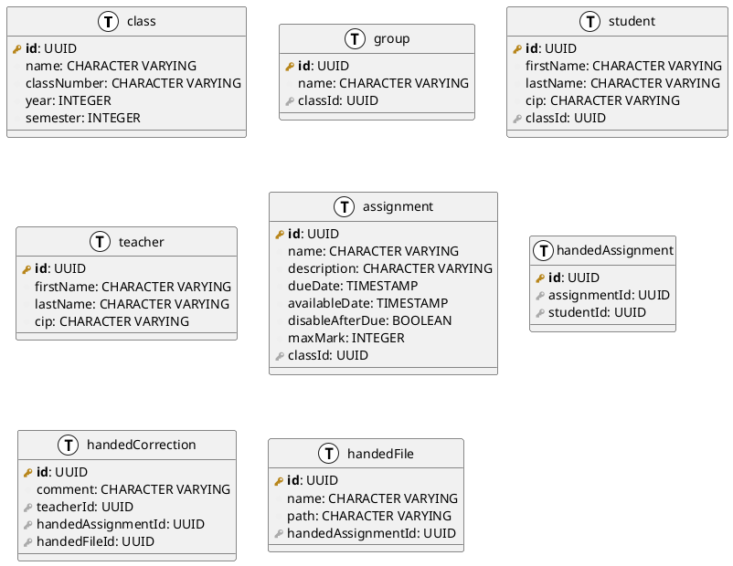

```plantuml
@startuml

!define primary_key(x) <b><color:#b8861b><&key></color> x</b>
!define foreign_key(x) <color:#aaaaaa><&key></color> x
!define column(x) <color:#efefef><&media-record></color> x
!define table(x) entity x << (T, white) >>

table(class){
    primary_key( id ): UUID
    column( name ): CHARACTER VARYING
    column( classNumber ): CHARACTER VARYING
    column( year ): INTEGER
    column( semester ): INTEGER
}

table(group){
    primary_key( id ): UUID
    column( name ): CHARACTER VARYING
    foreign_key( classId ): UUID
}

table(student){
    primary_key( id ): UUID
    column( firstName ): CHARACTER VARYING
    column( lastName ): CHARACTER VARYING
    column( cip ): CHARACTER VARYING
    foreign_key( classId ): UUID
}

table(teacher){
    primary_key( id ): UUID
    column( firstName ): CHARACTER VARYING
    column( lastName ): CHARACTER VARYING
    column( cip ): CHARACTER VARYING
}

table(assignment){
    primary_key( id ): UUID
    column( name ): CHARACTER VARYING
    column( description ): CHARACTER VARYING
    column( dueDate ): TIMESTAMP
    column( availableDate ): TIMESTAMP
    column( disableAfterDue ): BOOLEAN
    column( maxMark ): INTEGER
    foreign_key( classId ): UUID
}

table(handedAssignment){
    primary_key( id ): UUID
    foreign_key( assignmentId ): UUID
    foreign_key( studentId ): UUID
}

table(handedCorrection){
    primary_key( id ): UUID
    column( comment ): CHARACTER VARYING
    foreign_key( teacherId ): UUID
    foreign_key( handedAssignmentId ): UUID
    foreign_key( handedFileId ): UUID
}

table(handedFile){
    primary_key( id ): UUID
    column( name ): CHARACTER VARYING
    column( path ): CHARACTER VARYING
    foreign_key( handedAssignmentId ): UUID
}

@enduml
```