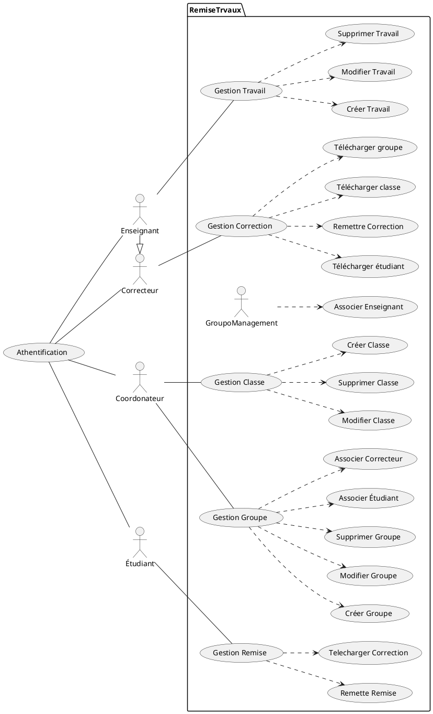

## Abstraction
- Remise : Travail remis par un étudiant
- Correction : Correction d'un travail remis par un enseignant ou un correcteur
- Travail : Travail à remettre par un étudiant créer par un enseignant