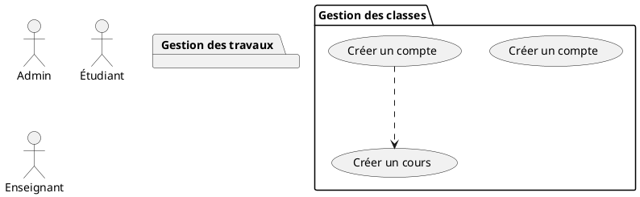

```plantuml
@startuml

:Admin: as Admin
:Étudiant: as Student
:Enseignant: as Teacher 

package "Gestion des classes" {
    (Créer un cours) as (CreateClass)
    (Créer un compte) as (CreateAccount)
    (Créer un compte) ..> (CreateClass)
}

package "Gestion des travaux"{

}

@enduml
```